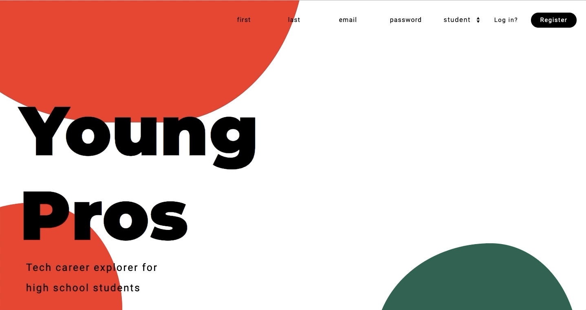

# Young Pros

## Description 

Young Pros - is a single-page application built with React.js, that I developed in 6 days as a final project for Spiced Academy, Berlin (12-week full-stack web development bootcamp). It is a platform that helps high school students to find a mentor and learn more about various tech careers before they make a decision to devote themselves to a specific career path.

## Stack

- React.js including Hooks and Redux.
- Axios for performing HTTP requests.
- API requests to Udemy for displaying relevant courses.
- AWS S3 for storing images.
- Socket.IO for realtime messaging.
- PostgreSQL for storing user's data.
- Node.js and Express.
- Multer and FormData for file upload.
- Cookie Session and csurf against CSRF attacks.
- CSS.

## Features

- two types of user profiles: for mentors and for students. 
- mentors can pick their area of expertise, create and edit a personal profile, add a mentorship offer.
- students can create and edit a personal profile, discover various career paths, pick relevant courses and add them to favourites. Courses, marked as favorites, will appear directly at student's profile. Courses can be removed from favorites. 
- students and mentors can have a real-time one-on-one conversation in a messenger. 

## Preview

- Landing page:

  

- Add profile info, upload an image, add / edit bio.

  

- Check out careers and courses, add courses to favorites section in user's profile. Remove courses from favourites, when the course is finished.

  

- Get the list of relevant tutors. Realtime chat with a tutor.

  

  

